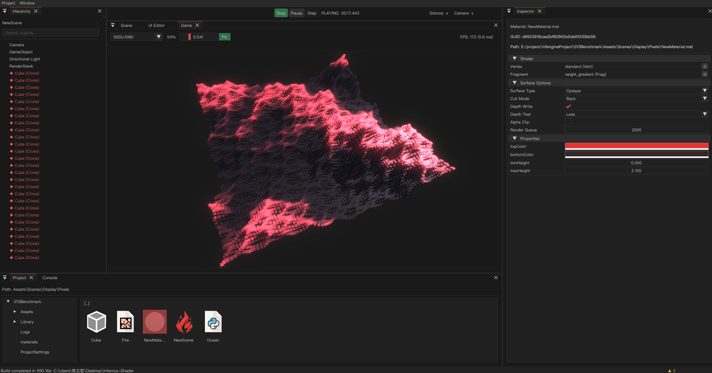

<p align="center">
  
</p>

<h1 align="center">Infernux</h1>

<p align="center">
  <strong>Open-source game engine with a C++17 / Vulkan runtime and a Python production layer.</strong>
</p>

<p align="center">
  <a href="LICENSE"></a>
  
  
  
  
  
</p>

<p align="center">
  <a href="README-zh.md">中文文档</a> ·
  <a href="https://chenlizheme.github.io/Infernux/">Website</a> ·
  <a href="https://chenlizheme.github.io/Infernux/wiki.html">Docs</a> ·
  <a href="https://arxiv.org/pdf/2604.10263">Technical Report</a> ·
  <a href="#quick-start">Quick Start</a>
</p>

## Runtime Capture

<p align="center">
  
</p>

<p align="center">
  <em>Editor session left running in Play mode while the scene continues to render at runtime.</em>
</p>

## Overview

Infernux is a from-scratch engine for developers who want control over the runtime, the editor workflow, and the scripting surface instead of treating the engine as a sealed product.

The project combines three layers:

- A native C++17 / Vulkan runtime for rendering, scene systems, physics, audio, and platform services.
- A pybind11 bridge that exposes the native runtime to Python.
- A Python layer for gameplay, editor tooling, content workflows, build automation, and render authoring.

The architectural goal is straightforward: keep the hot path native, keep iteration fast, and keep the codebase understandable enough that teams can extend it without reverse-engineering hidden policy.

## Current Scope

Infernux is currently a Windows-first technical preview. The project already contains a usable editor/runtime core, but it should still be evaluated as an actively evolving engine rather than a finished commercial platform.

Core capabilities available today include:

- Vulkan forward and deferred rendering, PBR, cascaded shadows, MSAA, shader reflection, and post-processing.
- RenderGraph and RenderStack APIs authored from Python.
- Jolt physics integration with rigidbodies, colliders, scene queries, callbacks, and layer filtering.
- GUID-based assets, dependency tracking, scene serialization, prefab workflows, and play-mode isolation.
- An integrated editor with Hierarchy, Inspector, Scene View, Game View, Project, Console, UI editing, and build settings.
- Python-side component lifecycle, coroutines, serialized fields, and script reload support.
- Basic runtime UI primitives including Canvas, Text, Image, Button, and pointer events.
- **2D animation (preview):** sprite `SpiritAnimator`, `AnimClip2D` assets, animation state machine assets, and editor panels for authoring. Expect breaking changes while the stack stabilizes.
- Packaging paths for the Hub, a standalone bundle, and a Windows installer.

## Architecture

| Layer | Responsibility |
|:------|:---------------|
| C++17 / Vulkan | Rendering, resource ownership, scene systems, physics, audio, platform integration |
| pybind11 bridge | Native bindings exposed to Python |
| Python | Gameplay, editor logic, tooling, automation, render authoring |

This split keeps performance-sensitive systems in native code while leaving day-to-day production code in a language that is easier to iterate on and easier to connect to external tooling and data pipelines.

## Quick Start

### Prerequisites

<details>
<summary><b>Windows</b></summary>

| Dependency | Version |
|:-----------|:--------|
| Windows | 10 / 11 (64-bit) |
| Python | 3.12+ |
| Vulkan SDK | 1.3+ |
| CMake | 3.22+ |
| Visual Studio | 2022 (MSVC v143) |
| pybind11 | 2.11+ |

</details>

<details>
<summary><b>macOS</b></summary>

| Dependency | Version |
|:-----------|:--------|
| macOS | 12+ |
| Python | 3.12+ |
| Vulkan SDK | 1.3+ (LunarG SDK with MoltenVK) |
| CMake | 3.22+ |
| Ninja | 1.10+ |
| Xcode Command Line Tools | Latest |
| pybind11 | 2.11+ |

Install the Vulkan SDK from <https://vulkan.lunarg.com/sdk/home> and source the environment script after installation.

```bash
source ~/VulkanSDK/<version>/setup-env.sh
brew install cmake ninja
```

</details>

Any Python 3.12 environment works. The commands below use Conda because that is the most common workflow in this repository.

### Clone

```bash
git clone --recurse-submodules https://github.com/ChenlizheMe/Infernux.git
cd Infernux
```

If the repository was cloned without submodules:

```bash
git submodule update --init --recursive
```

### Build

```bash
conda create -n infengine python=3.12 -y
conda activate infengine
pip install -r requirements.txt
cmake --preset release
cmake --build --preset release
```

On macOS, replace `release` with `release-macos`.

The build copies the native module and runtime dependencies into the Python package so `import Infernux` works directly from the active environment.

### Launch the Hub in development mode

```bash
conda activate infengine
python packaging/launcher.py
```

Development mode uses the current Python environment and local build outputs. It does not install the Hub's managed runtime.

### Run tests

```bash
conda activate infengine
cd python
python -m pytest test/ -v
```

## Documentation

- Website: <https://chenlizheme.github.io/Infernux/>
- Documentation hub: <https://chenlizheme.github.io/Infernux/wiki.html>
- Technical report: [Infernux: A Python-Native Game Engine with JIT-Accelerated Scripting (arXiv:2604.10263)](https://arxiv.org/pdf/2604.10263)
- API reference: generated from the Python package and published under `docs/wiki/site/`

To regenerate the API markdown and static site locally:

```bash
conda activate infengine
python docs/wiki/generate_api_docs.py
python -m mkdocs build --clean -f docs/wiki/mkdocs.yml
```

Equivalent CMake targets are `generate_api_docs` and `build_wiki_html`.

## Packaging

Two distribution paths are currently supported for the Hub.

### Standalone bundle

```bash
cmake --build --preset packaging
```

This produces the portable PyInstaller output under `dist/Infernux Hub/`.

### Windows installer

```bash
cmake --build --preset packaging-installer
```

This produces the graphical Windows installer, which stages the matching Python 3.12 runtime for the host architecture and provisions project runtimes from that managed base.

## Citation

If you use Infernux in research, technical writing, or published work, cite it as software:

```bibtex
@software{chen2026infernux,
  author  = {Chen, Lizhe},
  title   = {Infernux},
  year    = {2026},
  version = {0.1.3},
  url     = {https://github.com/ChenlizheMe/Infernux},
  note    = {Open-source game engine with a C++17/Vulkan runtime and a Python production layer}
}
```

## Contributing

Bug reports, feature requests, and workflow feedback are all useful at the current stage. When filing an issue, include the engine version, environment details, reproduction steps, and whether the problem sits in the native runtime, the Python layer, or packaging.

Contribution and support policies live in:

- `CONTRIBUTING.md`
- `SECURITY.md`
- `SUPPORT.md`

## License

Infernux is released under the MIT License. See `LICENSE` for details.
